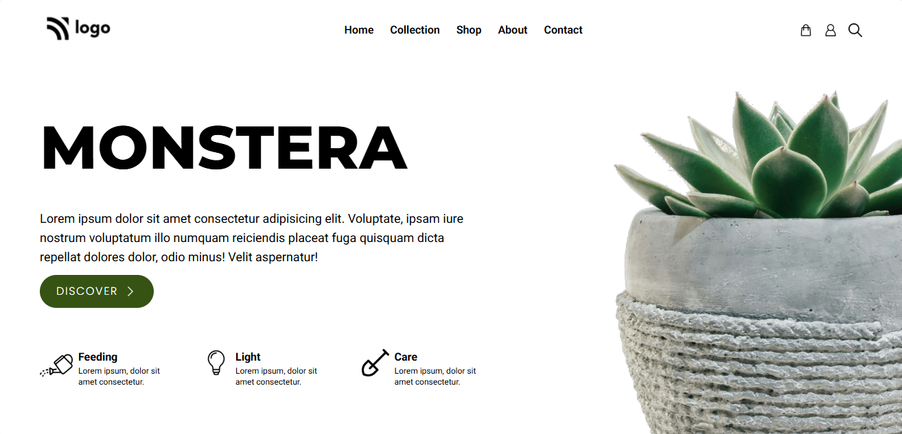
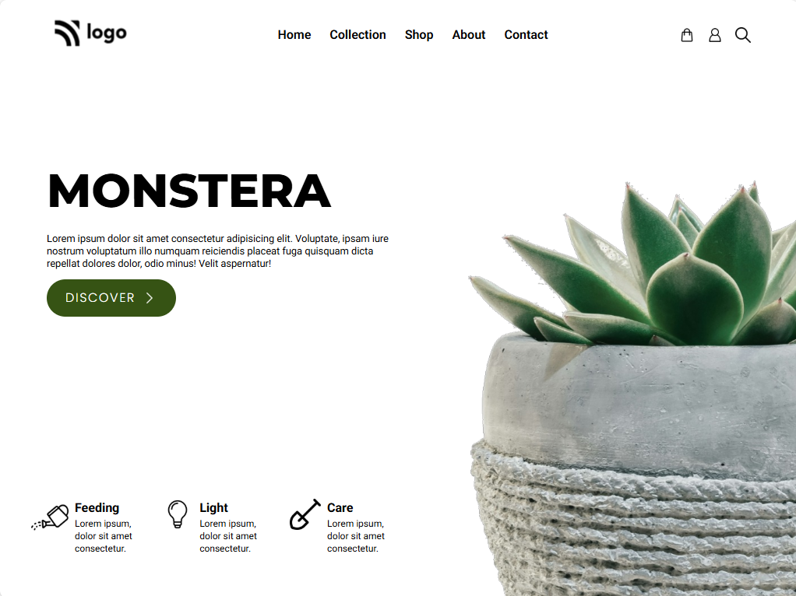
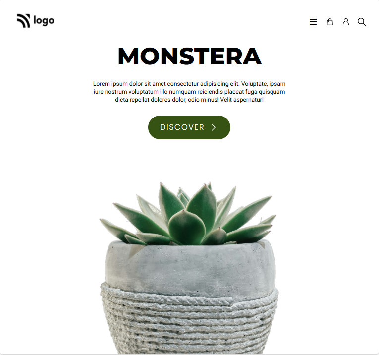

# Monstera Landing Page

A responsive and modern landing page designed for a plant, home decor, or lifestyle brand. This project features a clean layout, bold typography, and a visually appealing hero section built with Tailwind CSS.

---

## Preview

### Laptop view


---
### iPad view


---
### Tab view


---

### Mobile view


---

## Features

* Responsive design for mobile and desktop
* Clean navigation bar with menu and utility icons
* Bold hero section with call-to-action button
* Informational feature highlights for product care
* Decorative background image layout
* Styled using Tailwind CSS with custom fonts

---

## Tech Stack

* HTML5
* Tailwind CSS (via CDN)
* Font Awesome (optional)
* Google Fonts (Montserrat, Poppins, Roboto)

---

## Project Structure

```bash
project-folder/
│
├── index.html
├── images/
│   ├── logo.png
│   ├── shopping-bag.png
│   ├── user.png
│   ├── loupe.png
│   ├── arrow.png
│   ├── watering-can.png
│   ├── bulb.png
│   ├── shovel.png
│   └── bg.png
└── README.md
```

---

## Getting Started

1. Download or clone the repository:

```bash
git clone https://github.com/Sushara/Tailwind-monstera.git
```

2. Open the project:

Open `index.html` in your browser.

---

## Customization

You can easily update the project based on your needs:

* Change the brand name and hero text
* Replace images inside the `/images` folder
* Adjust fonts, spacing, and layout using Tailwind classes
* Update navigation links and feature sections

---

## Deployment

You can deploy this project using:

* GitHub Pages
* Netlify
* Vercel

---

## Notes

* This project uses Tailwind CSS via CDN, so no build process is required
* Internet connection is required for external fonts and icons to load

---

## License

Free to use for personal and educational purposes.
