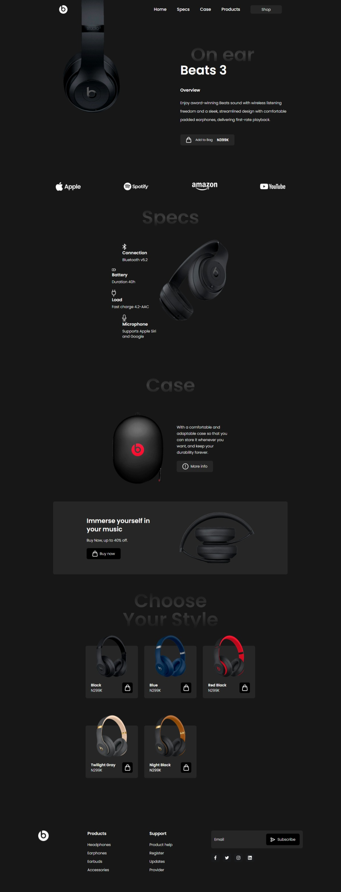
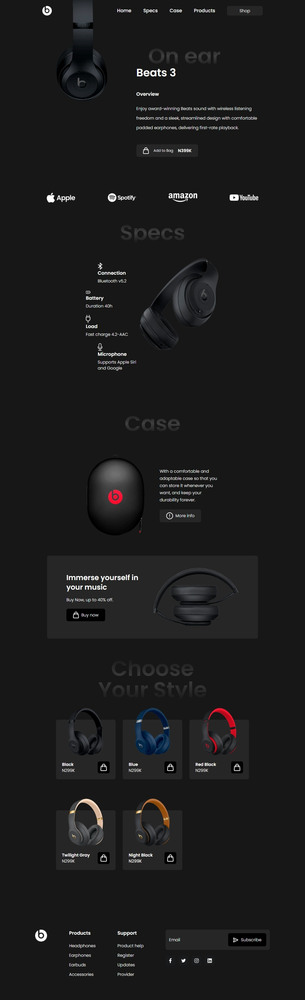
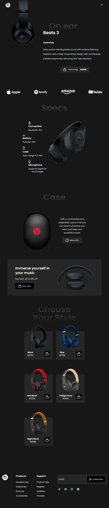
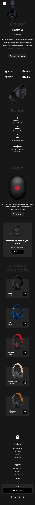

# Beats Headphones Landing Page

A responsive product landing page for **Beats 3** on-ear headphones, built with HTML and Tailwind CSS.

---

## Preview

### Laptop view


---
### iPad view


---
### Tab view


---

### Mobile view


---

## Tech Stack

- **HTML5**
- **Tailwind CSS** (via CDN — `@tailwindcss/browser@4` + `cdn.tailwindcss.com`)
- **Font Awesome 7** (icons)
- **Google Fonts** — Poppins, Montserrat, Roboto, Orbitron

---

## Project Structure

```
project/
├── index.html
├── images/
│   ├── mainImage.png
│   ├── beatsLogo.png
│   ├── specsImage.png
│   ├── caseImage.png
│   ├── buyNowSectionImage.png
│   ├── appleLogo.png
│   ├── spotifyLogo.png
│   ├── amazonLogo.png
│   ├── youtubeLogo.png
│   ├── flight.png
│   ├── black.png
│   ├── blue.png
│   ├── redBlack.png
│   ├── twilightGray.png
│   └── nightBlack.png
└── Icons/
    ├── shoppingBag.png
    ├── bluetooth.png
    ├── battery.png
    ├── charger.png
    ├── mic.png
    ├── group.png
    ├── rightArrow.png
    ├── facebook.png
    ├── twitter.png
    ├── instagram.png
    └── linkedin.png
```

---

## Getting Started

1. Download or clone the repository:

```bash
git clone https://github.com/Sushara/Beats.git
```

2. Open the project:

Open `index.html` in your browser.

---

## Customization

You can easily customize the project:

* Update heading and description text
* Replace images inside the `/images` folder
* Modify fonts and spacing using Tailwind classes
* Update navigation items

---

## Deployment

You can deploy this project using:

* GitHub Pages
* Netlify
* Vercel

---

## Notes

* This project uses Tailwind via CDN, so no build setup is required
* Internet connection is required for fonts and icons to load

---

## License

Free to use for personal and educational purposes.
